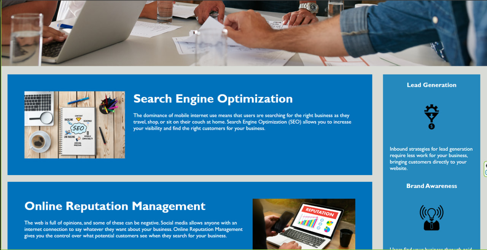
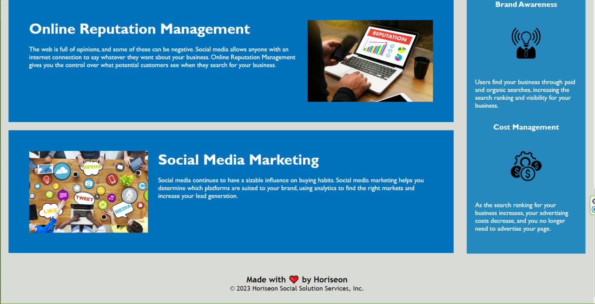

# Horiseon-upgradation

Refactoring code to add accessibility

## Description

I refactor the original codebase that it follows accesibility standards. 
I changed all non-semantic to semantic HTML elements.
I added `alt` attributes to all image elements.
Also, I changed title to more descriptive version.

## Table of Contets

- [Screenshots](#screenshots)
- [Links](#links)

## Screenshots

In this section I provide screenshots of the final product.

## Links

In this section I added links to the project itself and the original codebase I used from begining.

Deployed aplication
 https://mykhailozakh.github.io/Horiseon-upgradation/

Project Repositorie
 https://github.com/MykhailoZakh/Horiseon-upgradation

Original Repositorie with Original CodeBase
 https://github.com/coding-boot-camp/urban-octo-telegram
